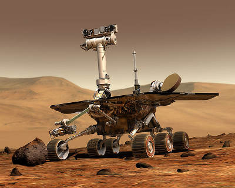
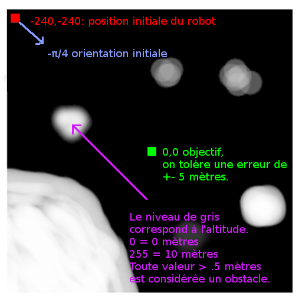
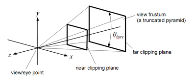
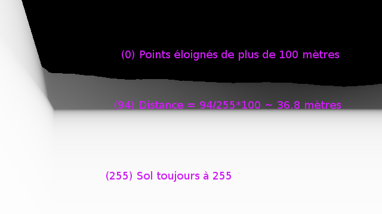

Projet ASE 2015
===============


Version du document Descriptif des changements Auteur
------------------- -------------------------- ---------------------
0.0.1               Version initiale           Pablo Oliveira <pablo.oliveira@uvsq.fr>





Ce document décrit l'objectif, l'organisation et la notation du projet ASE'15.

Une version PDF de ce document est disponible à l'adresse
<http://tahiti.prism.uvsq.fr/ase/projet/Projet.pdf>.

## Organisation du projet

### Objectif

Le but de ce projet est d'écrire un contrôleur pour un robot d'exploration, de
type "Mars Rover". Le robot doit se déplacer sur la surface de Mars et 
atteindre sa destination objectif. Pour pouvoir éviter les reliefs difficiles,
le robot est doté d'une caméra qui mesure la distance. Votre contrôleur doit
analyser les images de la caméra et donner des ordres de type TURN (tourner) ou
FORWARD (avancer) au robot.

De plus, le robot a des batteries limitées, votre contrôleur doit être
le plus économe possible en énergie. Enfin, les capacités mémoire du
robot sont contraintes, votre code doit avoir l'empreinte mémoire la plus faible.

### Constitution des Groupes

Ce projet est à faire par binôme ou trinôme.

### Rendu

Le projet est à rendre avant le lundi 16 février 2015 à 23h59.  Le rendu du
projet se fait par mail sur mon adresse pablo.oliveira@uvsq.fr.  Le mail
comportera obligatoirement le sujet "[ASE] Rendu projet". L'ensemble des
étudiants ayant participé au projet seront dans l'entête CC du mail.

Le rendu comporte deux parties:

1. Un rapport, au format ```pdf```, expliquant le travail réalisé et justifiant les choix
d'implémentation effectués. En particulier, votre rapport apportera une réponse aux questions suivantes:

   * Comment a été organisé le code de votre contrôleur ?

   * Comment le robot évite les obstacles ?

   * Comment le robot décide de la route pour atteindre l'objectif ? Est-ce la route la plus courte, si non pourquoi ?

   * Quels mécanismes, simplifications d'algorithmes, etc. ont été mis en place pour économiser l'énergie ?

   * Quels choix ont été fait pour réduire l'emprunte mémoire de votre code ?

2. Une archive, au format ```.tar.gz```, contenant:

   * un README avec le nom des auteurs et les éventuelles dépendances à installer avant de compiler votre code;

   * un Makefile;

   * l'ensemble de votre code *commenté*.

Le rapport et l'archive seront joints au mail de rendu.

### Plagiat
Si vous empruntez du code il faut:

   1. Citer sa provenance

   2. S'assurer que la licence du code vous permet de l'employer

Vous pouvez discuter et collaborer entre groupes, mais il est strictement
interdit de copier du code entre groupes.

Il est interdit de publier votre code.

Je vous invite à consulter les règles concernant le Plagiat de l'UVSQ:
<http://www.etu.uvsq.fr/jsp/saisie/liste_fichiergw.jsp?OBJET=DOCUMENT&CODE=1409307985391&LANGUE=0>

## Description détaillée du projet

## Contraintes

Votre code sera codé en C ou/et en assembleur ARM.  Vous essayerez au
maximum de réduire les dépendances vers des bibliothèques extérieures.

Un binaire dont l'emprunte mémoire est faible, sera noté favorablement.

## Prérequis

Pour tester votre code, vous utiliserez un programme qui simulera
les mouvements et actualisera l'image caméra de votre robot.

Le simulateur est disponible à l'adresse suivante:
<http://tahiti.prism.uvsq.fr/ase/projet/ASE-mars-rover.tar.gz>
Ce même simulateur sera utilisé pour évaluer vos projets.

Une fois téléchargé, l'archive doit être décompressée:
```bash
$ tar xvf ASE-mars-rover.tar.gz
$ cd ASE-mars-rover/
```

Le simulateur est composé de deux modules:

1. Le simulateur de terrain, à exécuter sur votre ordinateur, dont le code est dans le répertoire ```simulator/```
2. Un moniteur, à exécuter sur la machine virtuelle ARM ou sur votre ordinateur, qui fait l'interface entre votre code et le simulateur de terrain.

### Installation et utilisation du simulateur

Avant de pouvoir compiler le simulateur il vous faut installer les librairies suivantes:

 * gl (OpenGL)

 * glew

 * glu

 * glut

 * microhttpd

Sous debian ou ubuntu, il vous suffit de taper la commande suivante:

```bash
$ sudo apt-get install mesa-common-dev freeglut3-dev libglu1-mesa-dev libmicrohttpd-dev libglew-dev
```

Une fois les dépendances installées, vous pouvez faire:

```bash
$ make -C simulator/
make: Entering directory '/home/poliveira/ASE-mars-rover/simulator'
cc -g -Wall -std=gnu99   -c -o ase-rover.o ase-rover.c
cc -g -Wall -std=gnu99   -c -o server.o server.c
cc -g -Wall -std=gnu99   -c -o shaders.o shaders.c
cc -g -Wall -std=gnu99   -c -o terrain.o terrain.c
cc -g -Wall -std=gnu99   -c -o tga.o tga.c
cc -g -o simulator ase-rover.o server.o shaders.o terrain.o tga.o -lglut -lGL -lm -lGLU -lGLEW -lmicrohttpd
make: Leaving directory '/home/poliveira/ASE-mars-rover/simulator'
```

Si tout ce passe bien, un exécutable `simulator/simulator` sera généré.
Pour lancer le simulateur il faut choisir une carte dans `maps/`, par exemple `map1.tga`, et taper:

```bash
$ simulator/simulator maps/map1.tga
```

### Installation et utilisation du moniteur

Le moniteur requiert uniquement une version `python2` récente. La
version installée sur le RaspberryPi est suffisante.

Pour l'utiliser il suffit de lancer la commande:

```bash
$ monitor/monitor.py --server http://192.168.1.1:8888 ./mon-programme
```

où `192.168.1.1` est l'adresse de la machine qui exécute le simulateur
et `./mon-programme` est votre exécutable.

Un contrôleur démo est fourni dans l'archive, pour le lancer tapez les
commandes suivantes:

```bash
$ sudo apt-get install python-matplotlib python-numpy
$ monitor/monitor.py --server http://localhost:8888 ./demo/demo.py
```

Il est conseillé d'examiner le code de `demo.py` pour comprendre
comment envoyer des ordres au moniteur.

## Interfaçage avec le moniteur

Pour communiquer avec le moniteur, votre programme utilise la sortie
standard.  Les lignes commençant par `CMD` sont considérées comme des
commandes, les autres lignes sont ignorées.  A la fin de chaque
commande, le simulateur répond en écrivant une ligne sur l'entrée
standard.

Trois commandes sont disponibles:

  * `CMD TURN <ANGLE>` fait tourner le robot sur lui même de `<ANGLE>` radians.
    Par exemple, `CMD TURN 1.57079633` effectue une rotation de 180 degrés.

    Le simulateur doit répondre `OK`.

  * `CMD FORWARD <DISTANCE>` fait avancer le robot de `<DISTANCE>` mètres.
    Par exemple, `CMD FORWARD 1.5` avance le robot de 1.5 mètres.

    Le simulateur répond `OK` si tout c'est bien passé ou tue votre
    programme si la commande produit une collision avec un obstacle.

  * `CMD CAMERA` demande à la caméra de profondeur de transmettre un cliché.
    Le simulateur transmet une image de 640x360 pixels en format PGM version P2,
    décrit ici <http://netpbm.sourceforge.net/doc/pgm.html>.

## Spécifications de la mission

Votre robot sera évalué sur plusieurs cartes. Des exemples de cartes
sont disponibles dans le répertoire `maps/`.  Chaque carte représente
la topographie d'un secteur martien carré de 512x512 mètres.



Le centre du secteur à pour coordonnées $(0,0)$.  Au début de chaque
mission la position de votre robot est $(-240,-240)$ et son
orientation initiale $-\frac{\pi}{4}$.

La topographie du secteur est représentée par les niveaux de gris dans
l'image, noir (0) représente 0 mètres, blanc (255) représente 10
mètres. Tout point dont l'altitude est supérieure à 0.5 mètres est
infranchissable.

L'objectif est toujours le même: atteindre les coordonnées $(0,0)$
sans percuter un obstacle.


## Spécifications du robot

Le robot est considéré comme un cube de 50cm x 50 cm x 50 cm.  Une
tolérance de 5 mètres est admise pour atteindre l'objectif.

Pour simplifier, on admet que le robot ne peut jamais percuter un
obstacle en tournant sur lui même.

La consommation énergétique du robot (pour alimenter tous ses
composants) est de 50W.  Une rotation du robot consomme 50J par
radian.  Un déplacement du robot consomme 100J par mètre.


## Spécifications de la caméra

Votre robot est équipée d'une caméra qui mesure la distance aux
obstacles.

La caméra peut détecter les obstacles à 100 mètres maximum. Au delà de
cette distance, la caméra est aveugle.

La caméra est fixée en haut de votre robot par un axe. Elle se situe à
une hauteur de 50 cm au dessus du sol, son axe focal est parallèle au
sol et orienté comme le robot.

La caméra capture une projection en perspective de l'environnement.



L'angle focal est de 45 degrés La caméra capture les objets entre
deux plans, sur la figure _near clipping plane_ et _far clipping
plane_.

La distance au _near clipping plane_ est de 0.1 mètres et la distance
au _far clippling plane_ est de 100 mètres.

Le _near clipping plane_ correspond à l'image qui vous est
retournée de 640 x 360 pixels. Pour calculer la valeur d'un pixel vous
pouvez imaginer que des rayons sont tirés entre chaque objet et
l'observateur, le pixel où le rayon traverse le _near clipping plane_
est colorié en fonction de la distance parcourue par le rayon.

La camera retourne une image en niveaux de gris. La couleur de chaque
pixel représente la distance à la caméra pour ce point. La couleur 0
représente un point à 100 mètres ou plus. Une couleur à 255 représente
un point dont la distance est inférieure à 0.1 mètres.

_Attention_ pour simplifier la conception du simulateur, les points en
dessous de la ligne d'horizon sont toujours blancs.



## Remarques finales

Il est possible que le simulateur fourni ne corresponde pas tout à
fait aux spécifications de ce document. Dans ce cas, c'est un _bug_
merci de m'envoyer un mail ou encore mieux un patch :-)

Bon projet !
